# Basics of ML

## 1. Introduction

We were introduced to the concepts of Machine Learning and Deep Learning in the previous AI/ML session that we had. Now we delve deep into the core mathematical concepts that form the fundamentals of Machine Learning. 

When we speak about the fundamentals of Machine Learning 2 topics come to mind: firstly PCA or Principal Component Analysis and secondly SVD or Singular Value Decomposition.

To introduce you to these 2 concepts of ML we need to get started with a little bit of linear algebra.

## 2. Linear Algebra Walk-through - Linear Spaces

In linear algebra, we talk about linear spaces, which are also called vector spaces. I won't get into the details of it here, however, if you are interested, Hoffman & Kunze’s “Linear Algebra” and Sheldon Axler's “Linear Algebra done right” are 2 excellent references. 

For our case in point you can consider this linear space or vector space as multi-dimensional space with each attribute as a separate dimension. 
Each linear space has a dimension. Dimension is what you might think intuitively as the number of features or the columns/ attributes in the data which is minimally required to fully represent the data, but I’ll give you a simple example over here to help you in the process of grasping this concept. 

## 3. Linear Algebra Walk-through - Basis and Span

Let’s consider the two-dimensional linear space of real numbers. This is simply the xy-plane that you’re probably used to. Let me ask you a question–can you think of combination of vectors, or points, such that if you take their linear combination, can form the entire 2D space? A linear combination of two vectors x and y is ax + by, for any choice of constants a and b. So basically, here’s what I’m asking.

Can you find out a set of points, such that if I give you any random point, say 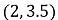, you’ll be able to find some unique constants a and b so that the linear combination of your set of points gives me  One easy choice is a unit vector in the x and the y directions. So we could take 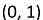 and 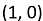.

So if you gave me , then 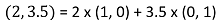, and you see the way we’ve done the multiplication and addition there. You should prove to yourself that given any point on the 2D space, you can easily find constants to multiply with this choice of vectors to get that point. We call such a set of points, a basis, and the basis is said to span the entire 2D linear space.

## 4. Linear Algebra Walk-through - Vector Subspaces

One important concept before we step back into machine learning and away from the mathematical bits is the concept of a subspace.

A subspace, also called a manifold, is a subset of a linear space. For example, we could have a linear subspace for the 2D linear space by restricting the second component to zero.

And if you think about it, now you’re really just stuck with real numbers since the second component isn’t very helpful–and real numbers form a 1D linear space.

Another example would be to put the restriction that both the components must be equal.

## 5. Principal Component Analysis

PCA is a dimensionality reduction technique which tries to find a linear subspace of the data that you currently have. So starting from a large set of attributes, you shrink it using PCA to a small set of attributes, which PCA calls as principal components. PCA assumes that these principal components are orthogonal to each other, and while this may not always be the case, in practice, PCA usually works reasonably well.

PCA transforms a set of vectors in a linear space to an orthogonal basis in a subspace. The eigenvectors and eigenvalues of a matrix represent the “core” of PCA: The eigenvectors (principal components) determine the directions of the new feature space, and the eigenvalues determine their magnitude.

An eigenvalue is a number, telling you how much variance there is in the data in that direction. Simply put, the eigenvalue is a number telling us how spread out the data is on that particular line or eigenvector. The eigenvector with the highest eigenvalue is therefore the principal component.

An orthogonal basis is simply a basis where each vector is orthogonal to every other. But that’s not the only great thing about PCA. The principal components that it gives you are in descending order of the variance explained. What does this mean? It means that when you take a point in the original linear space and project it to the subspace, then along the first principal component, it will be spread the most as compared to the others.

## 6. Uses of Principal Component Analysis

PCA is a dimensionality reduction technique which can be used for various tasks like:

   1. Visualization
      For eg: In stanford, they had data from around 50 points in a monkey's brain and needed a technique to visualize this. So they used PCA to reduce the dimensionality from 50 to a 3D space. This way they were able to visualize what the monkey was thinking in 3 dimensional graph.
		
   2. Image Compression
      We'll later on be working on this example ourselves in today's Hands-on Labs.
		
   3. Machine Learning
      To make the learning more efficient by performing dimensionality reduction using PCA.
	
   4. Anomaly or Outlier Detection
      Not the best anomaly detection algorithm. But, sometimes it's done.
		
   5. Matching/ Distance Calculation:
      Compare the projections on the dimensionally-reduced linear subspace for finding similarities and dissimilarities.

## 7. Singular Value Decomposition

Singular Value Decomposition (SVD) provides another way to factorize a matrix into singular vectors and singular values.

SVD enables us to discover some of the same kind of information as the eigendecomposition reveals, however, the SVD is more generally applicable. Every real matrix has a singular value decomposition, but the same is not true of the eigenvalue decomposition. SVD can be written as:

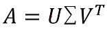

Suppose 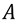 is an m x n matrix, then  is defined to be an m x m rotation matrix, 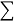 to be an m x n matrix scaling & projecting matrix, and 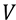 to be an n x n rotation matrix.

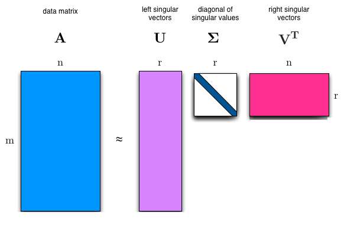

Each of these matrices is defined to have a special structure. The matrices  and  are both defined to be orthogonal matrices 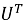 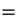 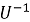 and 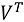  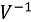. The matrix  is defined to be a diagonal matrix.

The elements along the diagonal of  are known as the singular values of the matrix . The columns of  are known as the left-singular vectors. The columns of  are known as the right-singular vectors.

## 8. Glossary

**Vector Spaces**:
Vector spaces as abstract algebraic entities were first defined by the Italian mathematician Giuseppe Peano in 1888. Peano called his vector spaces “linear systems” because he correctly saw that one can obtain any vector in the space from a linear combination of finitely many vectors and scalars—av + bw + … + cz.

**EigenVector and EigenValue**:
In linear algebra, an eigenvector (/ˈaɪɡənˌvɛktər/) or characteristic vector of a linear transformation is a nonzero vector that changes at most by a scalar factor when that linear transformation is applied to it. The corresponding eigenvalue, often denoted by lambda, is the factor by which the eigenvector is scaled.

**Linear Independence**:
In the theory of vector spaces, a set of vectors is said to be linearly dependent if there is a nontrivial linear combination of the vectors that equals the zero vector. If no such linear combination exists, then the vectors are said to be linearly independent. These concepts are central to the definition of dimension.

**Dimension**:
For every vector space there exists a basis,[a] and all bases of a vector space have equal cardinality;[b] as a result, the dimension of a vector space is uniquely defined.
