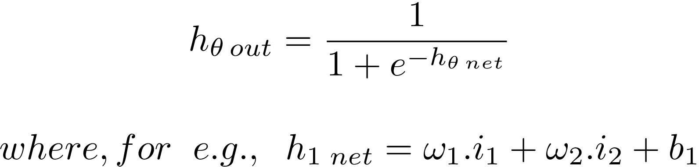
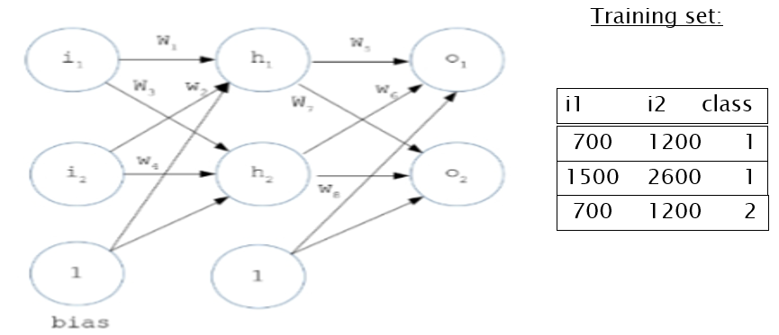

# Contributions
    Snehanshu Saha Sir from BITS Pilani
        For Teaching the mathematical concepts and also showing with examples on how to develop a Neural Network.
        And for sharing a working Artificial MultiLayerPerceptron implementation in Python
    Ramachandran C - M.Tech Student of Snehanshu Saha Sir in BITS Pilani

# Pyano - A Deep Neural Network Framework
An artificial neural network that utilizes back propagation for training. It has a total of 5  layers of neurons. The hidden layers have 4 each, the input layer has 3 and the output layer has 6 neurons.

# Deep Neural Network
The Layers in the Neural Network consist of:  
    1. Single Input Layer with 3 neurons.  
    2. Three Hidden Layers with 4 neurons each.  
    3. Single Output Layer with 6 neurons.

It represents a 6 class classification problem.

Weights are initialized randomly.

The Activation function is a sigmoid.

The Dataset has samples with 3 features each.

# Objective
Define and implement an Object-Oriented Deep Neural Network Framework (capable of implementing DNNs with multiple hidden layers) that predicts classes for a test set with decently accurate results.

Implement Back propagation algorithm to update weights.

Compute the forward and backward passes with error gradients for every input sample.

Repeat the process for every sample in the training set.
